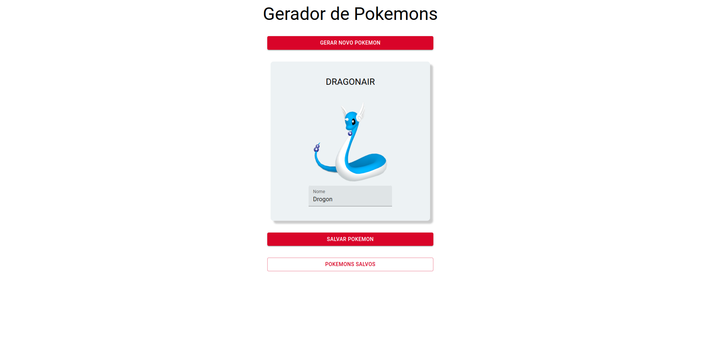
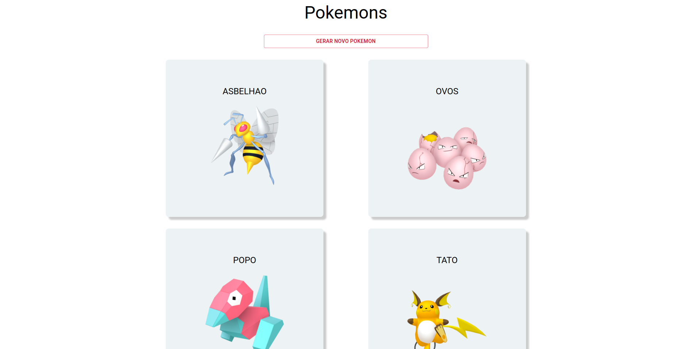

# Gerador de Pokemons - Frontend

## Teste monocard

### Saulo Kirchmaier Teixeira

Aplicação frontend realizado como um teste para a empresa [Monocard](https://monocard.com.br/).

### Teste

#### Proposta

- Criar um mini aplicatico web que gera um pokemon da geração 1 aleatório e permite nomeá-lo.

#### Frontend

- Tela para gerar o pokemon
- Tela com a lista de pokemons gerados

#### Backend

- API:
  1. Criar pokemons
  2. Listar pokemons criados

#### Banco de Dados

- Pokemons criados com:
  1. id
  2. nome
  3. pokemonId
  4. timestamo


### Desenvolvido frontend

Para o frontent foi desenvolvido um app web com [React](https://pt-br.reactjs.org/).

Nesta aplicação existem 2 telas:

  1. Tela de gerar pokemon, nomeá-lo e salvar no banco de dados.

    

  2. Tela de listagem de pokemons salvos com seus repectivos nomes.

    

### Instalação

#### Clonando o repositório

- Caso tenha uma chave SSH cadastrada faça um clone deste repositório com o comando no terminal:

  ```
  git clone git@github.com:saulokirchmaier/poke-generator-frontend.git
  ```

- Caso não possua uma chave SSH utilize o comando a baixo no terminal:

  ```
  git clone https://github.com/saulokirchmaier/poke-generator-frontend.git
  ```

#### Iniciando a API

- Crie um arquivo `.env` na raiz do projeto com:

  ```
  REACT_APP_URL=http://localhost:9000
  REACT_APP_POKEAPI=https://pokeapi.co/api/v2/pokemon
  ```

- Pelo terminal, acessse a pasta e instale as dependências de desenvolvimento:

  ```
  npm install
  ```

- Antes de inicar a aplicação web, rode o backend da aplicação seguindo os passos [aqui](https://github.com/saulokirchmaier/poke-generator-backend) 

- Com as dependências instaladas e o backend rodando, inicie a aplicação

  ```
  npm start
  ```
  
  - Caso tudo ocorra bem, devera ser logado:

  ```bash
  Compiled successfully!

  You can now view poke-generator-frontend in the browser.

    Local:            http://localhost:3000
    On Your Network:  http://192.168.2.116:3000

  Note that the development build is not optimized.
  To create a production build, use npm run build.

  webpack compiled successfully

  ```

    - a aplicação pode ser acessada por `http://localhost:3000`

#### Melhorias futuras

  - Criar tela de edição de pokemon
  - Criar botão de deletar pokemon
  - Criar mensagens de resposta negativas, caso ocorra algum problema na API, ex: snackbar

#### Agradecimentos

Obrigado por ter testado está aplicação

Um grande abraço.

Saulo Kirchmaier Teixeira.